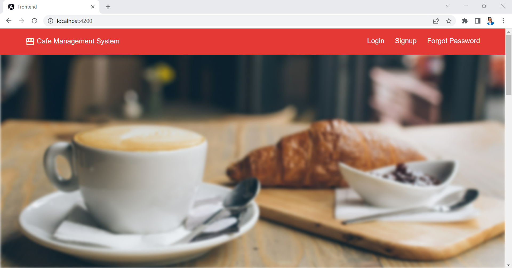
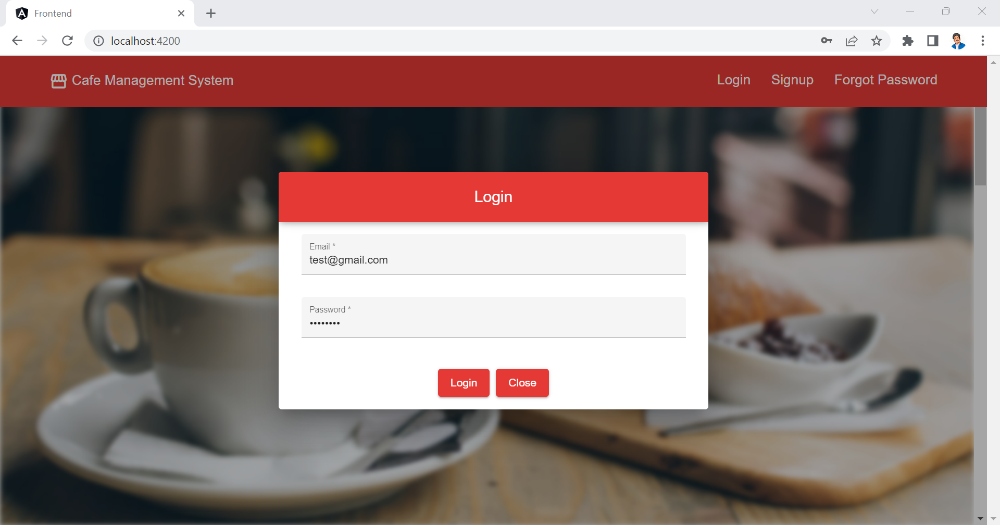
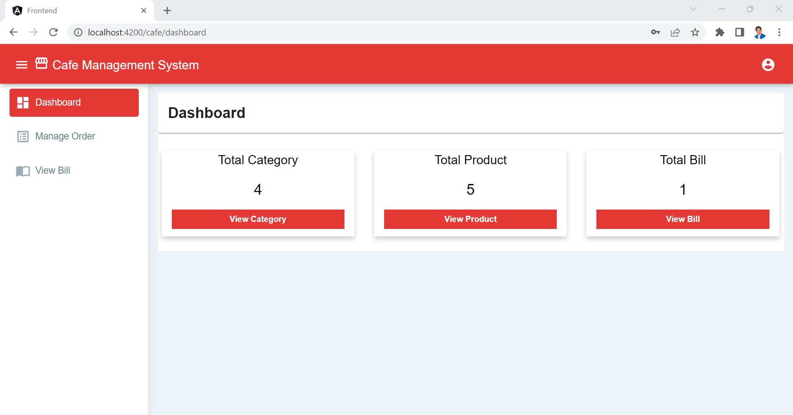
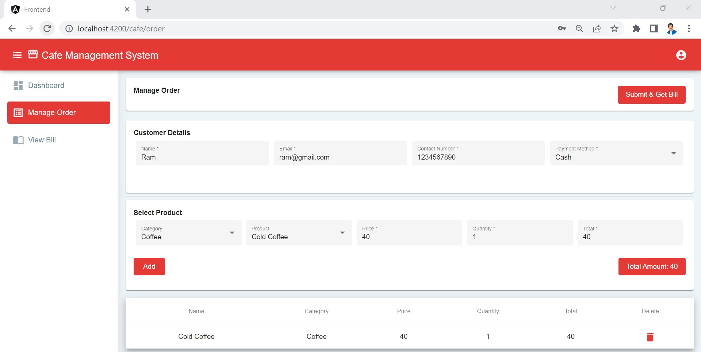
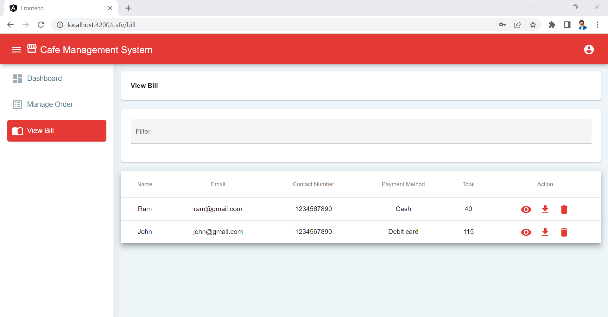
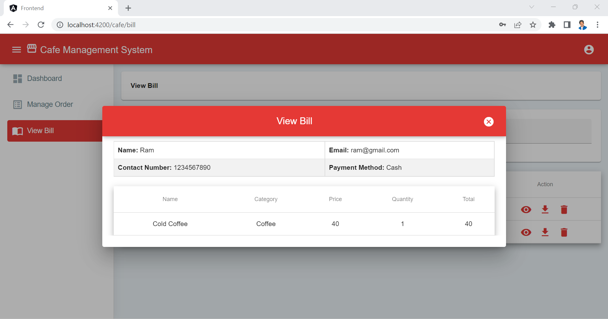
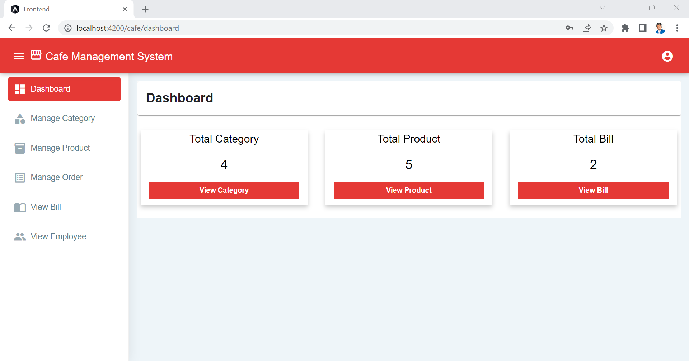
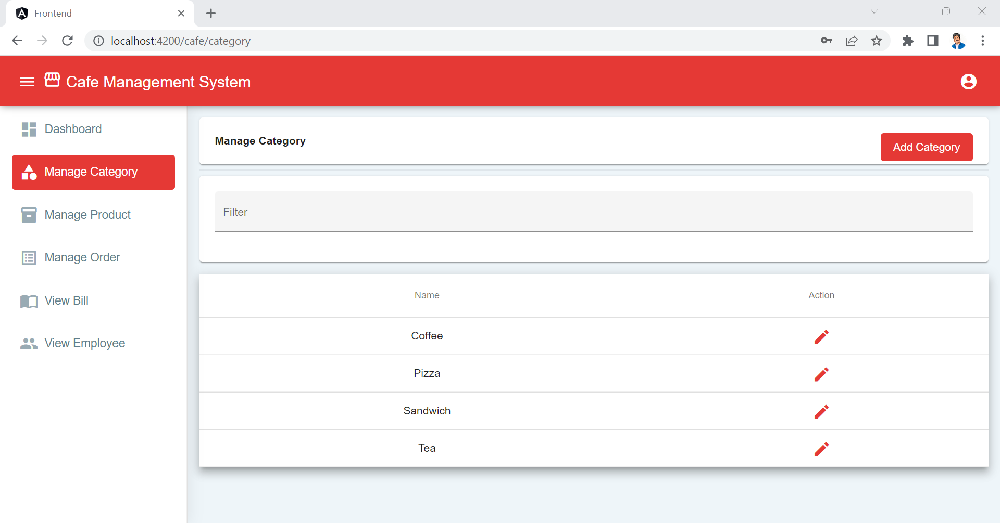
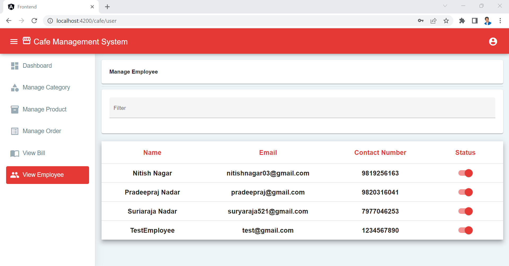

# Cafe Management System

Cafe Management System is a Web Application that has been created to provide a solution for a cafe / food-chain restaurant which operates like McDonald’s and it will enable the person on the counter (server) to accept orders from customer and pass it to the chef so that the chef can prepare the food/beverage, post that the admin can view entire order history and can also search/filter through them. The Admin can manage which employees (servers) are on duty on a given day and view all order history and bills of each and every order. They also can add items to the restaurant menu using the system and can also disable any menu item once it is actually out of stock. Servers only have access to place orders and view bills.

## Technologies used in the project

1. Node.js
2. Express.js
3. MySQL
4. RESTful API
5. TypeScript
6. Angular
7. HTML
8. SCSS
9. Visual Studio Code 

## MODEL:

* Waterfall model.

## Scope of Project

* To make the existing system more efficient.
* To provide one system to admin and servers(employees) in order to reduce manual work.
* To provide an easy-to-use interface for admin and servers(employees) alike. 

## Authors

- [Pradeepraj Nadar](https://github.com/Pradeepraj21/)
- [Nitish Nagar](https://github.com/nitish-nagar/)
